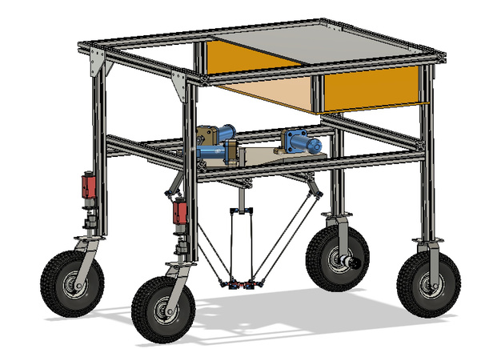
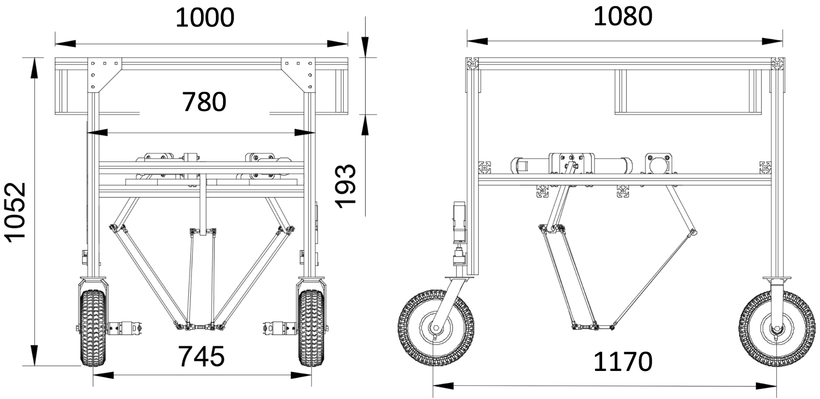
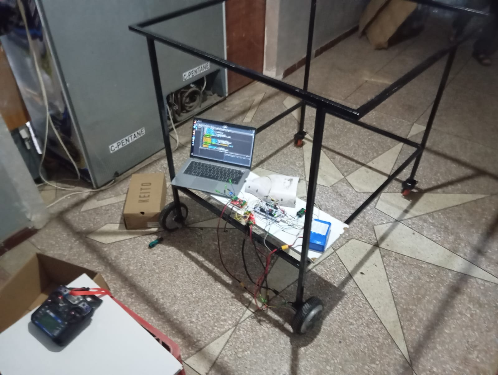
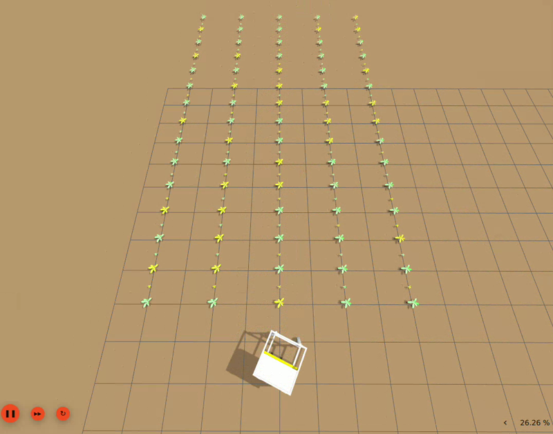
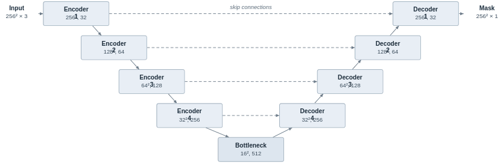
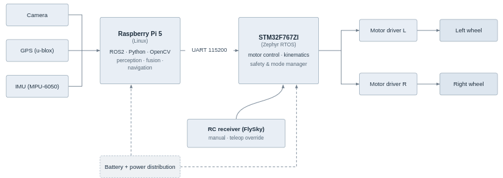
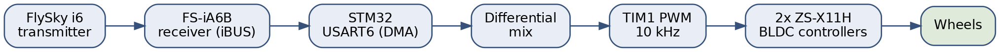
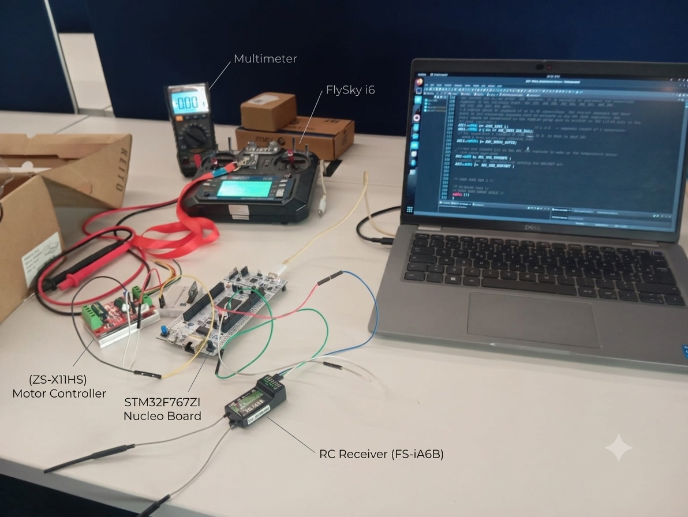
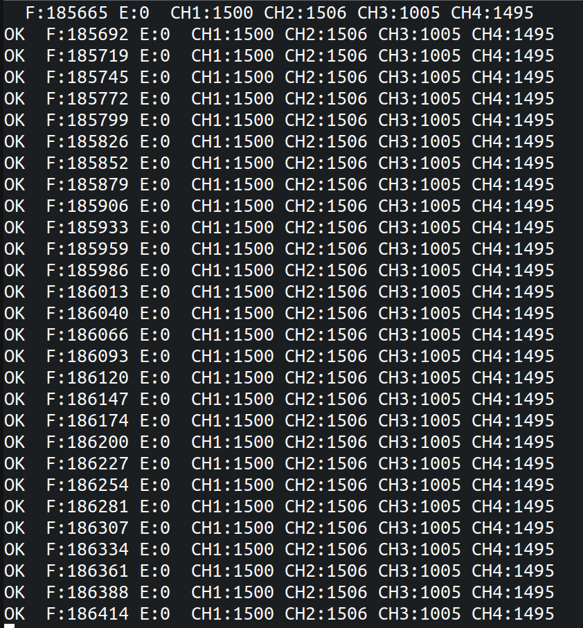
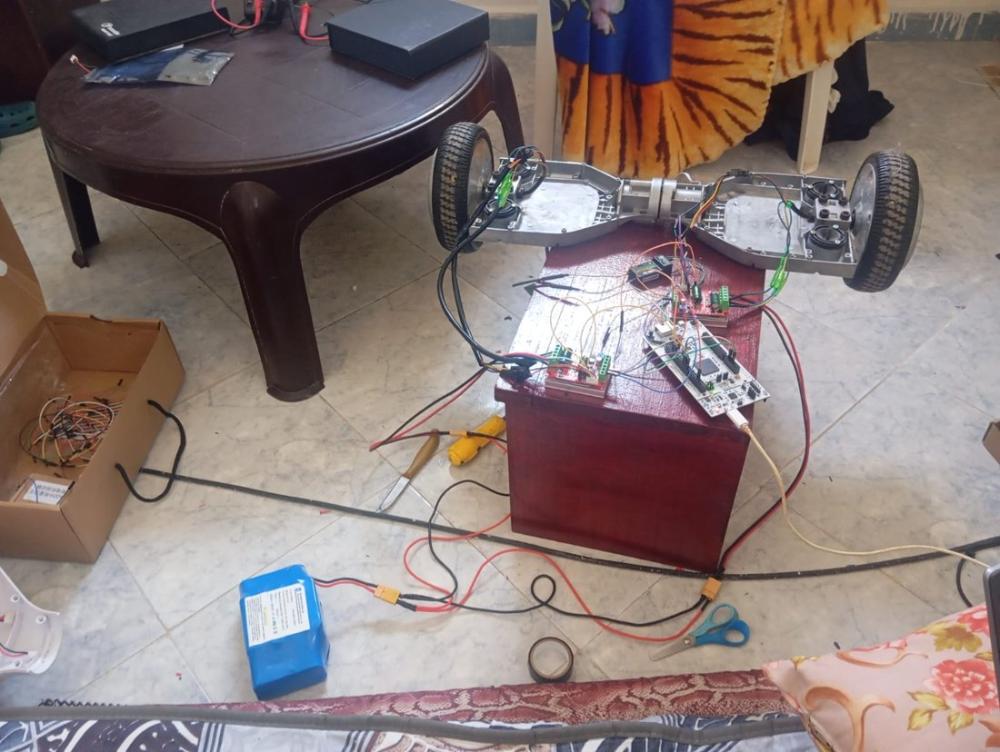

#MerKal_Project

A low-cost autonomous ground robot for **crop-row navigation**. The system is designed
simulation-first in Gazebo/ROS 2, then brought onto a physical differential-drive prototype.

The mechanical platform is based on the open-source **[PRBonn/agribot](https://github.com/PRBonn/agribot)**
project (Photogrammetry & Robotics Bonn, BSD-2-Clause). This repo focuses on the simulation
navigation stack and a physical hardware/firmware prototype.

---

## Platform

Differential-drive base: two driven front wheels and two rear casters on a **welded steel
frame**, with 3D-printed brackets and mounts for the electronics.

<table>
<tr>
<td><br><sub>(a) CAD model (Fusion 360 / SolidWorks)</sub></td>
<td><br><sub>(b) Body dimensions (mm): side view (left), front view (right)</sub></td>
</tr>
</table>

<br><sub>(c) Welded steel chassis assembled — drive wheels, rear casters and electronics fitted</sub>

---

## Simulation

The robot, sensors and a crop-row field are modelled in **Gazebo (Harmonic) + ROS 2**. The robot
follows a planned lawnmower path through the rows, with end-of-row detection, headland turns and
re-entry into the next row.



---

## Perception — U-Net crop-row detector

A lightweight **U-Net** turns each camera frame into a crop-row mask, from which the lateral
offset and heading error relative to the row are extracted.



- **Input/output:** 256×256 RGB → 256×256 single-channel probability mask
- **Encoder/decoder:** 32 → 64 → 128 → 256 → 512 (bottleneck), with skip connections
- **Loss:** Dice + binary cross-entropy · **Optimizer:** Adam (lr 1e-3, batch 8)
- **Validation IoU ≈ 0.78**, trained on auto-labelled Gazebo frames

---

## Sensor fusion

GPS, IMU and wheel odometry are fused with the U-Net measurement in an Extended Kalman Filter for
localization and in-row guidance.

> ℹ️ The fusion design and implementation details are **not shared publicly** in this repository.

---

## Hardware implementation

Physical prototype: hoverboard BLDC drive + STM32 low-level control + Raspberry Pi for perception.



| Subsystem | Detail |
|-----------|--------|
| Drive | 2× hoverboard BLDC motors (36 V) + 2 rear casters (differential) |
| Motor controllers | 2× ZS-X11H (6–60 V, 400 W, Hall commutation) |
| Motor power | 36 V hoverboard Li-ion (10S, 42 V max) — dedicated motor bus |
| Logic power | 80 W solar panel + 24 V battery → PWM charge controller (12/24 V, 10 A) → 2× LM2596 buck (Pi 5, STM32) |
| Compute | STM32F767ZI Nucleo (safety + motor control) · Raspberry Pi 5 (perception) |
| Sensors | RGB night-vision camera (CSI) · MPU6050 IMU |
| RC | FlySky i6 + FS-iA6B receiver (iBUS) |

Full power/signal architecture: [docs/system_diagram.pdf](docs/system_diagram.pdf)

**Teleoperation control chain:**





### Firmware status (STM32)

| Item | Status |
|------|--------|
| iBUS RC reception (DMA + IDLE-line, USART6) | ✅ Verified — ~135 frame/s, 0 errors |
| Debug console (ST-LINK VCP, USART3) | ✅ Working |
| Motor control (`motor.c`, diff-drive mix + failsafe) | ✅ Working — **full-vehicle teleoperation verified** |
| Arm button (momentary, PE15) | ✅ Implemented, ⏳ untested |

**Full-vehicle drive demo** — the assembled rover under FlySky RC control:
[▶ docs/media/rc_teleop_demo.mp4](docs/media/rc_teleop_demo.mp4)


https://github.com/user-attachments/assets/5515135c-1187-4567-86d2-14c21d44d0c6


Spring-centered sticks (CH1 steer / CH2 speed) → stop-on-release; a 100 ms RC failsafe stops both
motors on signal loss. An arm button (PE15) toggles drive on/off — the robot powers up **disarmed**.
Firmware sources in `firmware/stm32/Core/` — see `firmware/stm32/RC_DRIVE_NOTES.md` for the full
design log.

<table>
<tr>
<td><br><sub>iBUS console: 0 errors, channels live</sub></td>
<td><br><sub>Differential-drive bring-up: both hoverboard BLDC wheels driven under RC control</sub></td>
</tr>
</table>

---

## Repo structure

```
docs/         Figures and images
firmware/     STM32 firmware (V1 teleoperation)
software/     Raspberry Pi software + tools
hardware/     Schematics and wiring
```

## Roadmap

- **V1** — RC teleoperation ✅ *— full-vehicle drive demonstrated*
- **V2** — Pi `cmd_vel` over serial *(next)*
- **V3** — Odometry + EKF on hardware
- **V4** — Vision-based crop-row navigation

---

*Mechanical platform adapted from [PRBonn/agribot](https://github.com/PRBonn/agribot) (BSD-2-Clause).*
</content>
